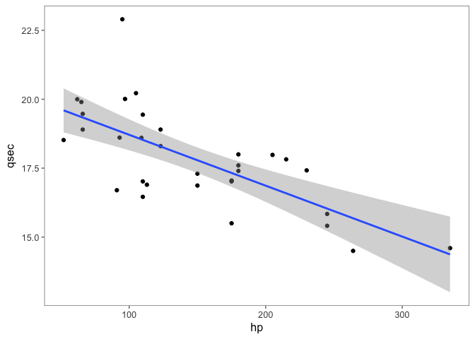
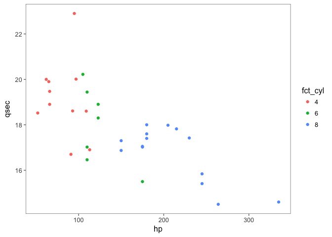

Tidyverse Demo
================

``` r
glimpse(mtcars)
```

    ## Observations: 32
    ## Variables: 11
    ## $ mpg  <dbl> 21.0, 21.0, 22.8, 21.4, 18.7, 18.1, 14.3, 24.4, 22.8, 19....
    ## $ cyl  <dbl> 6, 6, 4, 6, 8, 6, 8, 4, 4, 6, 6, 8, 8, 8, 8, 8, 8, 4, 4, ...
    ## $ disp <dbl> 160.0, 160.0, 108.0, 258.0, 360.0, 225.0, 360.0, 146.7, 1...
    ## $ hp   <dbl> 110, 110, 93, 110, 175, 105, 245, 62, 95, 123, 123, 180, ...
    ## $ drat <dbl> 3.90, 3.90, 3.85, 3.08, 3.15, 2.76, 3.21, 3.69, 3.92, 3.9...
    ## $ wt   <dbl> 2.620, 2.875, 2.320, 3.215, 3.440, 3.460, 3.570, 3.190, 3...
    ## $ qsec <dbl> 16.46, 17.02, 18.61, 19.44, 17.02, 20.22, 15.84, 20.00, 2...
    ## $ vs   <dbl> 0, 0, 1, 1, 0, 1, 0, 1, 1, 1, 1, 0, 0, 0, 0, 0, 0, 1, 1, ...
    ## $ am   <dbl> 1, 1, 1, 0, 0, 0, 0, 0, 0, 0, 0, 0, 0, 0, 0, 0, 0, 1, 1, ...
    ## $ gear <dbl> 4, 4, 4, 3, 3, 3, 3, 4, 4, 4, 4, 3, 3, 3, 3, 3, 3, 4, 4, ...
    ## $ carb <dbl> 4, 4, 1, 1, 2, 1, 4, 2, 2, 4, 4, 3, 3, 3, 4, 4, 4, 1, 2, ...

``` r
df <- mtcars %>%
    arrange(desc(hp)) %>%
    mutate(id = seq(1:nrow(mtcars)),
           fct_cyl = factor(cyl, levels = c(4, 6, 8)))
head(df)
```

    ##    mpg cyl disp  hp drat    wt  qsec vs am gear carb id fct_cyl
    ## 1 15.0   8  301 335 3.54 3.570 14.60  0  1    5    8  1       8
    ## 2 15.8   8  351 264 4.22 3.170 14.50  0  1    5    4  2       8
    ## 3 14.3   8  360 245 3.21 3.570 15.84  0  0    3    4  3       8
    ## 4 13.3   8  350 245 3.73 3.840 15.41  0  0    3    4  4       8
    ## 5 14.7   8  440 230 3.23 5.345 17.42  0  0    3    4  5       8
    ## 6 10.4   8  460 215 3.00 5.424 17.82  0  0    3    4  6       8

``` r
df %>%
    group_by(cyl) %>%
    summarize(N = n(),
              mean(hp), median(hp),
              mean(qsec), median(qsec))
```

    ## # A tibble: 3 × 6
    ##     cyl     N `mean(hp)` `median(hp)` `mean(qsec)` `median(qsec)`
    ##   <dbl> <int>      <dbl>        <dbl>        <dbl>          <dbl>
    ## 1     4    11   82.63636         91.0     19.13727         18.900
    ## 2     6     7  122.28571        110.0     17.97714         18.300
    ## 3     8    14  209.21429        192.5     16.77214         17.175

``` r
ggplot(df, aes(hp, qsec)) +
    geom_point() +
    geom_smooth(method = "lm") +
    ggthemes::theme_few()
```



``` r
ggplot(df, aes(hp, qsec, color = fct_cyl)) +
    geom_point() +
    ggthemes::theme_few()
```


