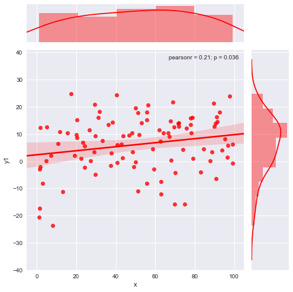

```python
%matplotlib inline
import numpy as np
import scipy.stats as stats
import pandas as pd
import matplotlib.pyplot as plt
import statsmodels.formula.api as smf
import seaborn as sns
```


```python
b0 = 0.5
b1 = 0.1
# from 1 to 100 in 1000 increments
x = np.linspace(1, 100, 1000)
# select a random subset of x values
x = np.random.choice(x, 100, replace=True)
# generate noise from a normal distribution
noise1 = stats.norm.rvs(loc=0.0, scale=10.0, size=len(x))
noise2 = stats.norm.rvs(loc=0.0, scale=1.0, size=len(x))
y1 = b0 + b1*x + noise1
y2 = b0 + b1*x + noise2
df = pd.DataFrame({'x': x, 'y1': y1, 'y2': y2})
```


```python
sns.jointplot('x', 'y1', data=df, kind='reg', xlim=(-5, 105), color="r", size=7)
```


    <seaborn.axisgrid.JointGrid at 0x10cd74e80>





```python
model = smf.ols(formula='y1 ~ x', data=df).fit()
model.summary()
```


<table class="simpletable">
<caption>OLS Regression Results</caption>
<tr>
  <th>Dep. Variable:</th>           <td>y1</td>        <th>  R-squared:         </th> <td>   0.044</td>
</tr>
<tr>
  <th>Model:</th>                   <td>OLS</td>       <th>  Adj. R-squared:    </th> <td>   0.034</td>
</tr>
<tr>
  <th>Method:</th>             <td>Least Squares</td>  <th>  F-statistic:       </th> <td>   4.497</td>
</tr>
<tr>
  <th>Date:</th>             <td>Sat, 06 May 2017</td> <th>  Prob (F-statistic):</th>  <td>0.0365</td>
</tr>
<tr>
  <th>Time:</th>                 <td>10:41:13</td>     <th>  Log-Likelihood:    </th> <td> -371.18</td>
</tr>
<tr>
  <th>No. Observations:</th>      <td>   100</td>      <th>  AIC:               </th> <td>   746.4</td>
</tr>
<tr>
  <th>Df Residuals:</th>          <td>    98</td>      <th>  BIC:               </th> <td>   751.6</td>
</tr>
<tr>
  <th>Df Model:</th>              <td>     1</td>      <th>                     </th>     <td> </td>   
</tr>
<tr>
  <th>Covariance Type:</th>      <td>nonrobust</td>    <th>                     </th>     <td> </td>   
</tr>
</table>
<table class="simpletable">
<tr>
      <td></td>         <th>coef</th>     <th>std err</th>      <th>t</th>      <th>P>|t|</th>  <th>[0.025</th>    <th>0.975]</th>  
</tr>
<tr>
  <th>Intercept</th> <td>    2.3566</td> <td>    2.050</td> <td>    1.150</td> <td> 0.253</td> <td>   -1.712</td> <td>    6.425</td>
</tr>
<tr>
  <th>x</th>         <td>    0.0738</td> <td>    0.035</td> <td>    2.121</td> <td> 0.036</td> <td>    0.005</td> <td>    0.143</td>
</tr>
</table>
<table class="simpletable">
<tr>
  <th>Omnibus:</th>       <td> 4.639</td> <th>  Durbin-Watson:     </th> <td>   1.885</td>
</tr>
<tr>
  <th>Prob(Omnibus):</th> <td> 0.098</td> <th>  Jarque-Bera (JB):  </th> <td>   4.475</td>
</tr>
<tr>
  <th>Skew:</th>          <td>-0.518</td> <th>  Prob(JB):          </th> <td>   0.107</td>
</tr>
<tr>
  <th>Kurtosis:</th>      <td> 2.956</td> <th>  Cond. No.          </th> <td>    121.</td>
</tr>
</table>


```python
sns.jointplot('x', 'y2', data=df, kind='reg', xlim=(-5, 105), size=7)
```


    <seaborn.axisgrid.JointGrid at 0x12036a4e0>


```python
model = smf.ols(formula='y2 ~ x', data=df).fit()
model.summary()
```


<table class="simpletable">
<caption>OLS Regression Results</caption>
<tr>
  <th>Dep. Variable:</th>           <td>y2</td>        <th>  R-squared:         </th> <td>   0.876</td>
</tr>
<tr>
  <th>Model:</th>                   <td>OLS</td>       <th>  Adj. R-squared:    </th> <td>   0.875</td>
</tr>
<tr>
  <th>Method:</th>             <td>Least Squares</td>  <th>  F-statistic:       </th> <td>   694.7</td>
</tr>
<tr>
  <th>Date:</th>             <td>Sat, 06 May 2017</td> <th>  Prob (F-statistic):</th> <td>2.80e-46</td>
</tr>
<tr>
  <th>Time:</th>                 <td>10:41:14</td>     <th>  Log-Likelihood:    </th> <td> -145.38</td>
</tr>
<tr>
  <th>No. Observations:</th>      <td>   100</td>      <th>  AIC:               </th> <td>   294.8</td>
</tr>
<tr>
  <th>Df Residuals:</th>          <td>    98</td>      <th>  BIC:               </th> <td>   300.0</td>
</tr>
<tr>
  <th>Df Model:</th>              <td>     1</td>      <th>                     </th>     <td> </td>   
</tr>
<tr>
  <th>Covariance Type:</th>      <td>nonrobust</td>    <th>                     </th>     <td> </td>   
</tr>
</table>
<table class="simpletable">
<tr>
      <td></td>         <th>coef</th>     <th>std err</th>      <th>t</th>      <th>P>|t|</th>  <th>[0.025</th>    <th>0.975]</th>  
</tr>
<tr>
  <th>Intercept</th> <td>    0.7513</td> <td>    0.214</td> <td>    3.505</td> <td> 0.001</td> <td>    0.326</td> <td>    1.177</td>
</tr>
<tr>
  <th>x</th>         <td>    0.0959</td> <td>    0.004</td> <td>   26.358</td> <td> 0.000</td> <td>    0.089</td> <td>    0.103</td>
</tr>
</table>
<table class="simpletable">
<tr>
  <th>Omnibus:</th>       <td> 1.578</td> <th>  Durbin-Watson:     </th> <td>   1.778</td>
</tr>
<tr>
  <th>Prob(Omnibus):</th> <td> 0.454</td> <th>  Jarque-Bera (JB):  </th> <td>   1.623</td>
</tr>
<tr>
  <th>Skew:</th>          <td> 0.253</td> <th>  Prob(JB):          </th> <td>   0.444</td>
</tr>
<tr>
  <th>Kurtosis:</th>      <td> 2.635</td> <th>  Cond. No.          </th> <td>    121.</td>
</tr>
</table>


```python

```
