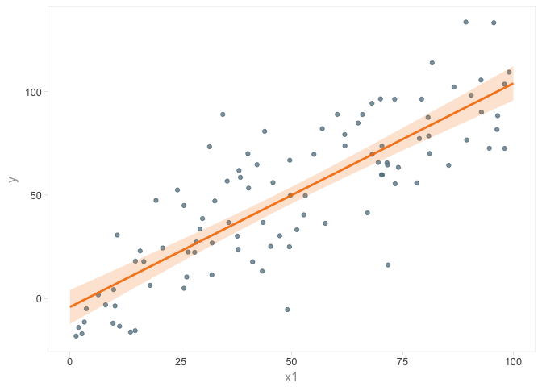

Linear regression in R using lm
================

``` r
x1 <- runif(n = 1e2, min = 0, max = 100)
b0 <- 2.0
b1 <- 1.0
eps <- rnorm(n = 1e2, mean = 0, sd = 20)
y <- b0 + (b1 * x1) + eps
df <- data_frame(y, x1)
df
```

    ## # A tibble: 100 × 2
    ##            y       x1
    ##        <dbl>    <dbl>
    ## 1   44.93942 25.71350
    ## 2  113.90982 81.67625
    ## 3   11.41699 32.01002
    ## 4   87.53625 80.75687
    ## 5   96.39415 79.30713
    ## 6   59.76371 70.44679
    ## 7   59.80777 70.24617
    ## 8   36.74993 43.54925
    ## 9   53.35105 40.28615
    ## 10  49.71395 53.06514
    ## # ... with 90 more rows

``` r
ggplot(df, aes(x1, y)) +
    geom_point(alpha = 0.75, color = md500$blue_grey) +
    theme_gr()
```


``` r
model <- lm(y ~ x1, data = df)
summary(model)
```

    ##
    ## Call:
    ## lm(formula = y ~ x1, data = df)
    ##
    ## Residuals:
    ##     Min      1Q  Median      3Q     Max
    ## -57.223 -14.349  -2.893  15.055  55.824
    ##
    ## Coefficients:
    ##             Estimate Std. Error t value Pr(>|t|)    
    ## (Intercept)  -4.1043     4.2042  -0.976    0.331    
    ## x1            1.0811     0.0736  14.688   <2e-16 ***
    ## ---
    ## Signif. codes:  0 '***' 0.001 '**' 0.01 '*' 0.05 '.' 0.1 ' ' 1
    ##
    ## Residual standard error: 20.71 on 98 degrees of freedom
    ## Multiple R-squared:  0.6876, Adjusted R-squared:  0.6845
    ## F-statistic: 215.7 on 1 and 98 DF,  p-value: < 2.2e-16

``` r
newdata_df <- data_frame(x1 = seq(0, 100, 0.1))
predict1 <- predict(model, newdata = newdata_df,
                    type = "response", se.fit = TRUE)
predicted_y <- predict1$fit
upper1 <- predict1$fit + (1.96 * predict1$se.fit)
lower1 <- predict1$fit - (1.96 * predict1$se.fit)

color <- md700$orange
ggplot() +
    geom_point(aes(x = x1, y = y), color = md500$blue_grey, alpha = 0.75) +
    geom_line(aes(x = newdata_df$x1, y = predicted_y), color = color,
              size = 1.0, alpha = 0.9) +
    geom_ribbon(aes(x = newdata_df$x1, ymin = lower1, ymax = upper1),
                fill = color, alpha = 0.2) +
    theme_gr()
```


