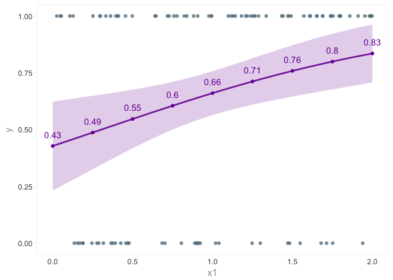

Logistic regression in R using glm
================

``` r
N <- 1e2
#x1 <- rbinom(n = N, 1, 0.3)
x1 <- runif(n = 1e2, min = 0, max = 2)
b0 <- 0.1
b1 <- 1.0

theta <- arm::invlogit(b0 + (b1 * x1))
y <- rep(NA, N);
for (i in 1:N) {
    y[i] = rbinom(1, 1, theta[i]);
}
df <- data_frame(y, x1)
df
```

    ## # A tibble: 100 × 2
    ##        y        x1
    ##    <int>     <dbl>
    ## 1      1 1.9892122
    ## 2      0 0.2875766
    ## 3      0 1.7518180
    ## 4      1 1.6117794
    ## 5      1 1.4413256
    ## 6      0 1.4710032
    ## 7      0 1.5485126
    ## 8      0 0.7024796
    ## 9      0 1.0193158
    ## 10     1 1.1424787
    ## # ... with 90 more rows

``` r
ggplot(df, aes(x1, y)) +
    geom_point(alpha = 0.5, color = md500$blue_grey) +
    theme_gr()
```


``` r
model <- glm(y ~ x1, data = df, family = binomial(link = "logit"))
summary(model)
```

    ##
    ## Call:
    ## glm(formula = y ~ x1, family = binomial(link = "logit"), data = df)
    ##
    ## Deviance Residuals:
    ##     Min       1Q   Median       3Q      Max  
    ## -1.8730  -1.2032   0.6922   0.9254   1.2927  
    ##
    ## Coefficients:
    ##             Estimate Std. Error z value Pr(>|z|)  
    ## (Intercept)  -0.2912     0.4073  -0.715   0.4747  
    ## x1            0.9563     0.3818   2.505   0.0123 *
    ## ---
    ## Signif. codes:  0 '***' 0.001 '**' 0.01 '*' 0.05 '.' 0.1 ' ' 1
    ##
    ## (Dispersion parameter for binomial family taken to be 1)
    ##
    ##     Null deviance: 129.49  on 99  degrees of freedom
    ## Residual deviance: 122.75  on 98  degrees of freedom
    ## AIC: 126.75
    ##
    ## Number of Fisher Scoring iterations: 4

``` r
newdata_df <- data_frame(x1 = seq(0, 2, 0.01))
predict1 <- predict(model, newdata = newdata_df,
                    type = "response", se.fit = TRUE)
predicted_y <- predict1$fit
upper1 <- predict1$fit + (1.96 * predict1$se.fit)
lower1 <- predict1$fit - (1.96 * predict1$se.fit)

x_to_label <- seq(0, 2, 0.25)
newdata_label1 <- data_frame(x1 = x_to_label)
y_to_label1 <- predict(model, newdata = newdata_label1, type = "response")
label1 <- round(y_to_label1, 2)

color <- md700$purple
ggplot() +
    geom_point(aes(x = x1, y = y), color = md500$blue_grey, alpha = 0.75) +
    geom_line(aes(x = newdata_df$x1, y = predicted_y), color = color,
              size = 1.0, alpha = 0.9) +
    geom_ribbon(aes(x = newdata_df$x1, ymin = lower1, ymax = upper1),
                fill = color, alpha = 0.2) +
    geom_point(aes(x = x_to_label, y = y_to_label1), color = color) +
    geom_text(aes(x = x_to_label, y = y_to_label1, label = label1),
                  nudge_y = 0.05, color = color, size = 4) +
    theme_gr()
```


