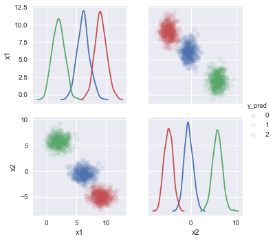

## KMeans Clustering using scikit-learn


```python
%matplotlib inline
import numpy as np
import pandas as pd
import seaborn as sns
from sklearn.datasets import make_blobs
from sklearn.cluster import KMeans
```

### Generate data


```python
X, y = make_blobs(n_samples=1000, centers=3, n_features=2)
df = pd.DataFrame(X)
df = df.rename(columns={0: 'x1', 1: 'x2'})
df['y'] = y
df.head()
```


<div>
<table border="1" class="dataframe">
  <thead>
    <tr style="text-align: right;">
      <th></th>
      <th>x1</th>
      <th>x2</th>
      <th>y</th>
    </tr>
  </thead>
  <tbody>
    <tr>
      <th>0</th>
      <td>3.515992</td>
      <td>5.718453</td>
      <td>2</td>
    </tr>
    <tr>
      <th>1</th>
      <td>0.979406</td>
      <td>6.933223</td>
      <td>2</td>
    </tr>
    <tr>
      <th>2</th>
      <td>8.014965</td>
      <td>-6.052760</td>
      <td>1</td>
    </tr>
    <tr>
      <th>3</th>
      <td>0.714026</td>
      <td>5.140077</td>
      <td>2</td>
    </tr>
    <tr>
      <th>4</th>
      <td>6.871349</td>
      <td>0.790905</td>
      <td>0</td>
    </tr>
  </tbody>
</table>
</div>


### Cluster data using KMeans


```python
k_means = KMeans(init='k-means++', n_clusters=3, n_init=10)
k_means.fit(df[['x1', 'x2']])
df['y_pred'] = k_means.labels_
k_means.cluster_centers_
```


    array([[ 6.14040257, -0.49850067],
           [ 2.01084733,  5.8233732 ],
           [ 9.04113487, -4.90957409]])


### Plot data and color by cluster


```python
sns.pairplot(df, hue='y_pred', vars=('x1', 'x2'), diag_kind="kde", plot_kws=dict(alpha=0.1, edgecolor=None))
```


    <seaborn.axisgrid.PairGrid at 0x12640b6d8>



