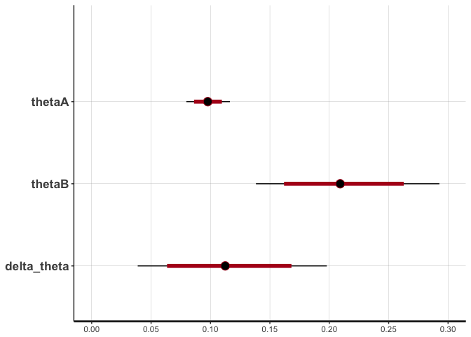

A/B test evaluation using beta-binomial model
================

``` r
nA <- 1000
nB <- 100
thetaA <- 0.10
thetaB <- 0.15
zA <- rbinom(n = 1, size = nA, prob = thetaA)
zB <- rbinom(n = 1, size = nB, prob = thetaB)
```

    data {
        int<lower=1> nA;
        int<lower=1> nB;
        int<lower=0> zA;
        int<lower=0> zB;
    }
    parameters {
        real<lower=0,upper=1> thetaA;
        real<lower=0,upper=1> thetaB;
    }
    transformed parameters {
        real<lower=-1,upper=1> delta_theta;
        delta_theta = thetaB - thetaA;
    }
    model {
        // Prior Distribution for Rate Theta
        thetaA ~ beta(4, 1);
        thetaB ~ beta(4, 1);
        // Observed Counts
        zA ~ binomial(nA, thetaA);
        zB ~ binomial(nB, thetaB);
    }

``` r
data <- list(nA = nA, nB = nB, zA = zA, zB = zB)

fit <- stan(file = 'beta_binomial.stan', data = data,
            iter = 2500, warmup = 500, chains = 1)
```



``` r
nA <- 10000
nB <- 10000
zA <- rbinom(n = 1, size = nA, prob = thetaA)
zB <- rbinom(n = 1, size = nB, prob = thetaB)
data <- list(nA = nA, nB = nB, zA = zA, zB = zB)
fit2 <- stan(file = 'beta_binomial.stan', data = data,
             iter = 2500, warmup = 500, chains = 1)
```


