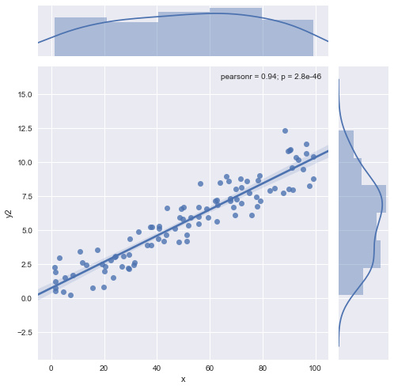

# work-sample
Collection of SQL, R, and Python demos

+ [`01_mysql.md`](https://github.com/grollins/work-sample/blob/master/01_mysql.md) - basic SQL queries

+ [`02_tidyverse.md`](https://github.com/grollins/work-sample/blob/master/02_tidyverse.md) - manipulating a data set with dplyr and plotting it using ggplot2

+ [`03_pd_demo.md`](https://github.com/grollins/work-sample/blob/master/03_pd_demo.md) - like `02_tidyverse.md` but using python, pandas, and seaborn

+ [`04_statsmodels.md`](https://github.com/grollins/work-sample/blob/master/04_statsmodels.md) - linear regression in python using statsmodels

+ [`05_scikit_learn.md`](https://github.com/grollins/work-sample/blob/master/05_scikit_learn.md) - comparing ML classifiers in python using scikit-learn

+ [`06_lm.md`](https://github.com/grollins/work-sample/blob/master/06_lm.md) - linear regression in R using lm

+ [`07_glm.md`](https://github.com/grollins/work-sample/blob/master/07_glm.md) - logistic regression in R using glm

+ [`08_kmeans.md`](https://github.com/grollins/work-sample/blob/master/08_kmeans.md) - kmeans clustering in python using scikit-learn

+ [`09_beta_binomial.md`](https://github.com/grollins/work-sample/blob/master/09_beta_binomial.md) - bayesian A/B testing model using RStan

+ [`10_poisson_gamma.md`](https://github.com/grollins/work-sample/blob/master/10_poisson_gamma.md) - fitting a statistical model to data using RStan

