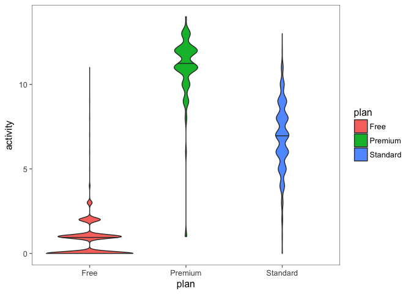
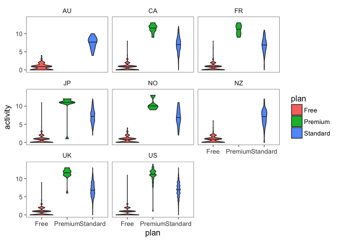

MySQL demo
================

Basic Queries
-------------

``` sql
SELECT
    id,
    country
FROM
    user_country
LIMIT 10
```

|      id| country |
|-------:|:--------|
|  712798| US      |
|  411180| US      |
|  122144| US      |
|   82178| NO      |
|  421443| CA      |
|  587101| NZ      |
|  930815| UK      |
|  209662| CA      |
|  373393| US      |
|  801112| US      |

``` sql
SELECT
    id,
    country
FROM
    user_country
WHERE
    country = 'US'
LIMIT 10
```

|      id| country |
|-------:|:--------|
|  712798| US      |
|  411180| US      |
|  122144| US      |
|  373393| US      |
|  801112| US      |
|  885486| US      |
|  924215| US      |
|  423274| US      |
|  305913| US      |
|  812507| US      |

``` sql
SELECT
    country,
    COUNT(DISTINCT id) AS num_users
FROM
    user_country
GROUP BY
    country
ORDER BY
    num_users DESC
```

| country |  num\_users|
|:--------|-----------:|
| US      |        5024|
| UK      |        1467|
| CA      |         963|
| FR      |         818|
| JP      |         817|
| NO      |         488|
| NZ      |         303|
| AU      |         103|

``` sql
SELECT
    id,
    activity
FROM
    user_activity
LIMIT 10
```

|      id|  activity|
|-------:|---------:|
|  712798|         0|
|  411180|         2|
|  122144|         0|
|   82178|         1|
|  421443|         2|
|  587101|         9|
|  930815|         6|
|  209662|         0|
|  373393|         0|
|  801112|         1|

``` sql
SELECT
    ua.id,
    ua.activity,
    uc.country
FROM
    user_activity ua
LEFT OUTER JOIN
    user_country uc
ON
    ua.id = uc.id
LIMIT 10
```

|      id|  activity| country |
|-------:|---------:|:--------|
|  712798|         0| US      |
|  411180|         2| US      |
|  122144|         0| US      |
|   82178|         1| NO      |
|  421443|         2| CA      |
|  587101|         9| NZ      |
|  930815|         6| UK      |
|  209662|         0| CA      |
|  373393|         0| US      |
|  801112|         1| US      |

``` sql
SELECT
    uc.country,
    MIN(ua.activity) AS min_activity,
    MAX(ua.activity) AS max_activity,
    AVG(ua.activity) AS mean_activity
FROM
    user_activity ua
LEFT OUTER JOIN
    user_country uc
ON
    ua.id = uc.id
GROUP BY
    uc.country
ORDER BY
    mean_activity DESC
```

| country |  min\_activity|  max\_activity|  mean\_activity|
|:--------|--------------:|--------------:|---------------:|
| NZ      |              0|             12|          2.1830|
| CA      |              0|             13|          2.1440|
| FR      |              0|             13|          2.0784|
| JP      |              0|             12|          2.0401|
| UK      |              0|             13|          2.0275|
| NO      |              0|             13|          2.0243|
| US      |              0|             14|          2.0104|
| AU      |              0|             10|          1.9423|

``` sql
SELECT
    id,
    plan
FROM
    user_plan
LIMIT 10
```

|      id| plan     |
|-------:|:---------|
|  712798| Free     |
|  411180| Free     |
|  122144| Free     |
|   82178| Free     |
|  421443| Free     |
|  587101| Premium  |
|  930815| Standard |
|  209662| Free     |
|  373393| Free     |
|  801112| Free     |

``` sql
SELECT
    plan,
    COUNT(DISTINCT id) AS num_users
FROM
    user_plan
GROUP BY
    plan
ORDER BY
    num_users DESC
```

| plan     |  num\_users|
|:---------|-----------:|
| Free     |        7894|
| Standard |        1976|
| Premium  |          90|

``` sql
SELECT
    up.plan,
    MIN(ua.activity) AS min_activity,
    MAX(ua.activity) AS max_activity,
    AVG(ua.activity) AS mean_activity
FROM
    user_activity ua
LEFT OUTER JOIN
    user_plan up
ON
    ua.id = up.id
GROUP BY
    up.plan
ORDER BY
    mean_activity DESC
```

| plan     |  min\_activity|  max\_activity|  mean\_activity|
|:---------|--------------:|--------------:|---------------:|
| Premium  |              1|             14|         11.0989|
| Standard |              0|             13|          6.9495|
| Free     |              0|             11|          0.7108|

Visualize in R using ggplot
---------------------------

``` r
ggplot(df_from_query, aes(plan, activity, fill = plan)) +
    geom_violin(draw_quantiles = c(0.5), adjust = 1.0) +
    ggthemes::theme_few()
```



``` r
ggplot(df_from_query, aes(plan, activity, fill = plan)) +
    geom_violin(draw_quantiles = c(0.5), adjust = 1.0) +
    facet_wrap(~country) +
    ggthemes::theme_few()
```


