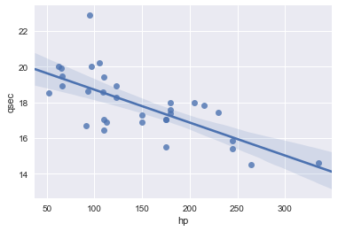
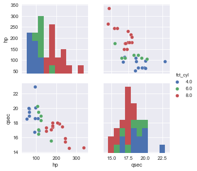

## Python pandas demo


```python
%matplotlib inline
import numpy as np
import pandas as pd
import seaborn as sns

df = (pd.read_csv('pd_demo_files/cars.csv')
        .sort_values(by='hp', ascending = False)
        .assign(fct_cyl=lambda x: pd.Categorical(x['cyl']))
        .reset_index())
print(df.head())
```

       index   mpg  cyl   disp     hp  drat     wt   qsec   vs   am  gear  carb  \
    0     26  15.0  8.0  301.0  335.0  3.54  3.570  14.60  0.0  1.0   5.0   8.0   
    1     22  15.8  8.0  351.0  264.0  4.22  3.170  14.50  0.0  1.0   5.0   4.0   
    2     29  13.3  8.0  350.0  245.0  3.73  3.840  15.41  0.0  0.0   3.0   4.0   
    3     28  14.3  8.0  360.0  245.0  3.21  3.570  15.84  0.0  0.0   3.0   4.0   
    4     27  14.7  8.0  440.0  230.0  3.23  5.345  17.42  0.0  0.0   3.0   4.0   

       id fct_cyl  
    0  27     8.0  
    1  23     8.0  
    2  30     8.0  
    3  29     8.0  
    4  28     8.0  


```python
(df.groupby('cyl')
   .size())
```


    cyl
    4.0    11
    6.0     7
    8.0    14
    dtype: int64


```python
(df.groupby('cyl')
   .hp.agg([np.mean, np.median]))
```


<div>
<table border="1" class="dataframe">
  <thead>
    <tr style="text-align: right;">
      <th></th>
      <th>mean</th>
      <th>median</th>
    </tr>
    <tr>
      <th>cyl</th>
      <th></th>
      <th></th>
    </tr>
  </thead>
  <tbody>
    <tr>
      <th>4.0</th>
      <td>82.636364</td>
      <td>91.0</td>
    </tr>
    <tr>
      <th>6.0</th>
      <td>122.285714</td>
      <td>110.0</td>
    </tr>
    <tr>
      <th>8.0</th>
      <td>209.214286</td>
      <td>192.5</td>
    </tr>
  </tbody>
</table>
</div>


```python
(df.groupby('cyl')
   .qsec.agg([np.mean, np.median]))
```


<div>
<table border="1" class="dataframe">
  <thead>
    <tr style="text-align: right;">
      <th></th>
      <th>mean</th>
      <th>median</th>
    </tr>
    <tr>
      <th>cyl</th>
      <th></th>
      <th></th>
    </tr>
  </thead>
  <tbody>
    <tr>
      <th>4.0</th>
      <td>19.137273</td>
      <td>18.900</td>
    </tr>
    <tr>
      <th>6.0</th>
      <td>17.977143</td>
      <td>18.300</td>
    </tr>
    <tr>
      <th>8.0</th>
      <td>16.772143</td>
      <td>17.175</td>
    </tr>
  </tbody>
</table>
</div>


```python
sns.regplot(data=df, x='hp', y='qsec')
```


    <matplotlib.axes._subplots.AxesSubplot at 0x118353c88>





```python
sns.pairplot(df, hue='fct_cyl', vars=['hp', 'qsec'])
```


    <seaborn.axisgrid.PairGrid at 0x10ac88518>





```python

```
